# Sistem Penunjang Keputusan Perpanjang Kontrak Kerja

**Sistem Penunjang Keputusan Perpanjang Kontrak Kerja** is a web‑application built to assist organizations in deciding whether to extend employment contracts for staff based on predefined criteria and data analysis.

## 🧩 Table of Contents

- [Motivation & Problem Statement](#motivation--problem-statement)
- [Features](#features)
- [Tech Stack](#tech-stack)
- [Installation & Setup](#installation--setup)
- [Project Structure](#project-structure)
- [Screenshot](#screenshot)
- [Authors](#authors)
- [Acknowledgements](#acknowledgements)

## Motivation & Problem Statement

Many organizations face the challenge of deciding whether to extend the contracts of employees. The decision is often based on multiple criteria such as performance, attendance, specialization, cost impact, etc. Manual evaluation can be time‑consuming and inconsistent.  
This system aims to streamline and standardize the decision process by integrating data and providing recommendations.

## Features

- Secure login and user management
- Comprehensive employee profile database (contract history, performance, attendance)
- Criteria definition for contract‑extension decision (customizable)
- Automated recommendation engine for contract extension based on criteria

## Tech Stack

- Backend: PHP with Laravel (as indicated by folder structure)
- Frontend: Blade templating + JavaScript, SCSS, CSS
- Build tools: Vite, Tailwind CSS (indicated by `tailwind.config.js`, `vite.config.js`, `package.json`)
- Database: MySQL / MariaDB (via Laravel’s ORM)
- Additional: PHPUnit for tests

## Installation & Setup

1. Clone the repository:

   ```bash
   git clone https://github.com/Annisarh/sistem-penunjang-keputusan-perpanjang-kontrak-kerja.git
   cd sistem-penunjang-keputusan-perpanjang-kontrak-kerja
   ```

2. Copy and configure environment variables:

   ```bash
   cp .env.example .env
   # Then edit .env to configure database, mail, etc.
   ```

3. Install dependencies:

   ```bash
   composer install
   npm install
   npm run dev
   ```

4. Generate application key (Laravel):

   ```bash
   php artisan key:generate
   ```

5. Run migrations and seeders (if any):

   ```bash
   php artisan migrate --seed
   ```

6. Serve the application:
   ```bash
   php artisan serve
   ```
   Then visit `http://localhost:8000` in your browser.

## Project Structure

A brief overview of notable directories:

```
app/            # Laravel application code (Models, Controllers, etc)
bootstrap/      # Laravel bootstrap files
config/         # Configuration files
database/       # Migrations & seeders
public/         # Web root (assets, index.php)
resources/      # Views, assets, SCSS, JavaScript
routes/         # Web, API route definitions
storage/        # Logs, cache, etc
tests/          # Automated tests
```

## Screenshot


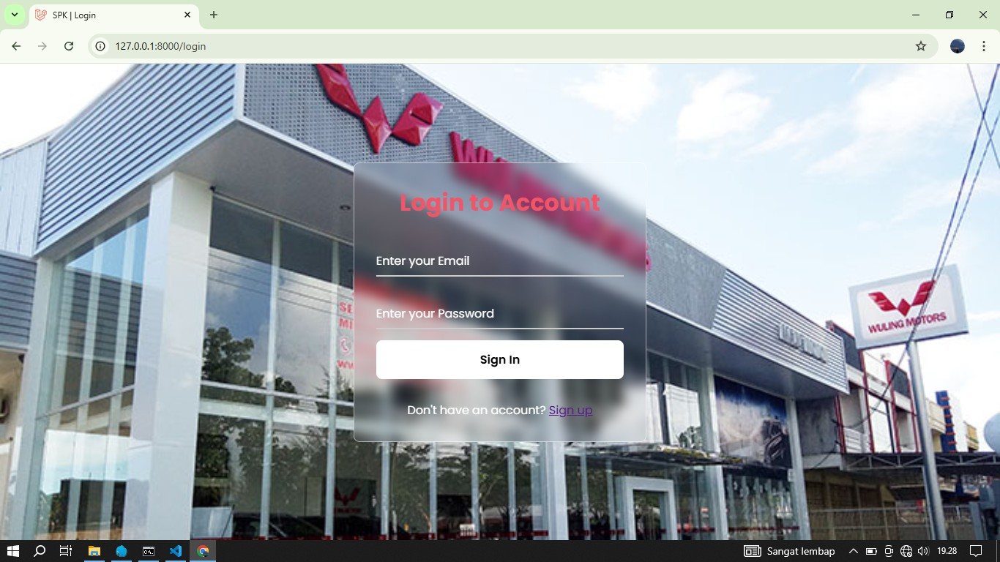
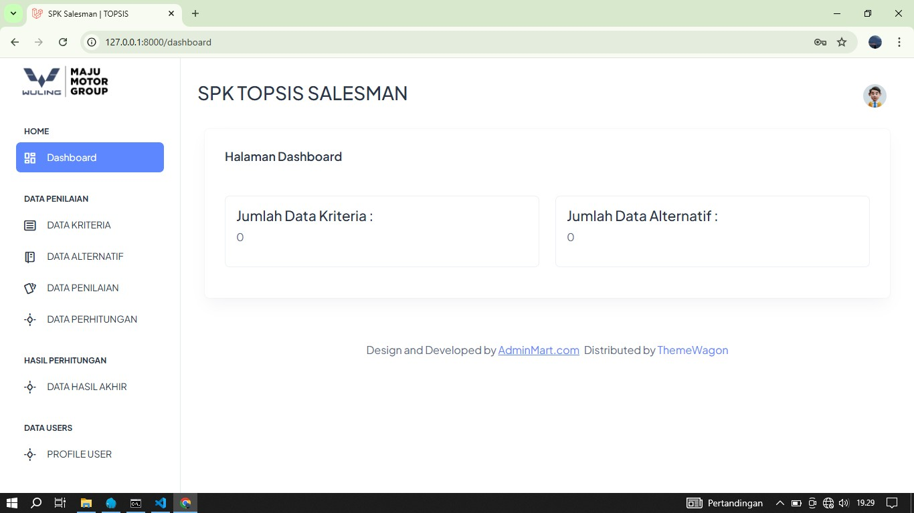
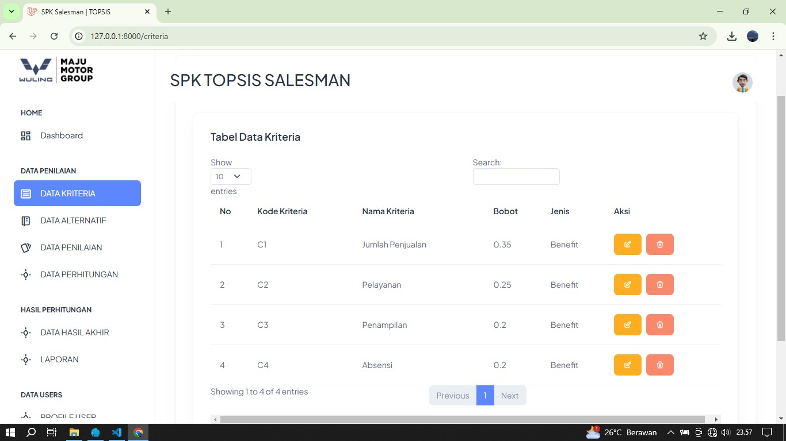
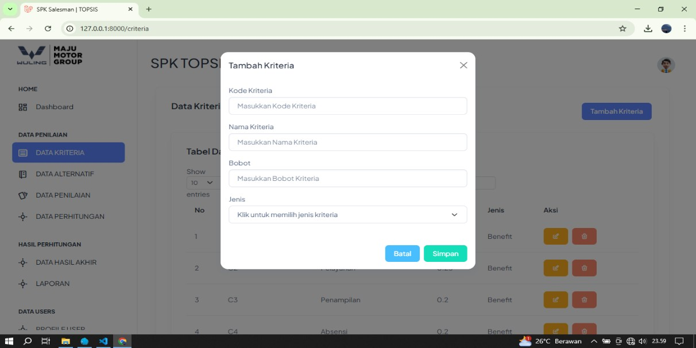
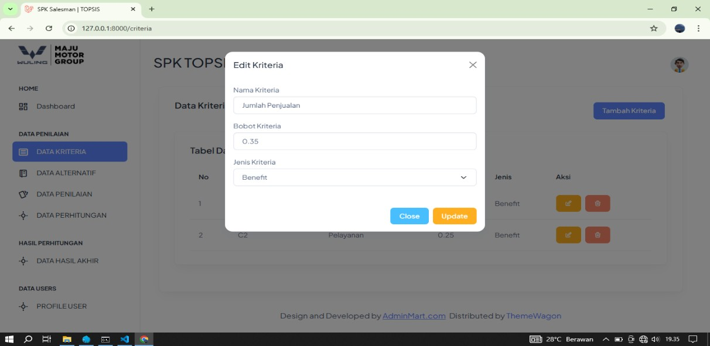
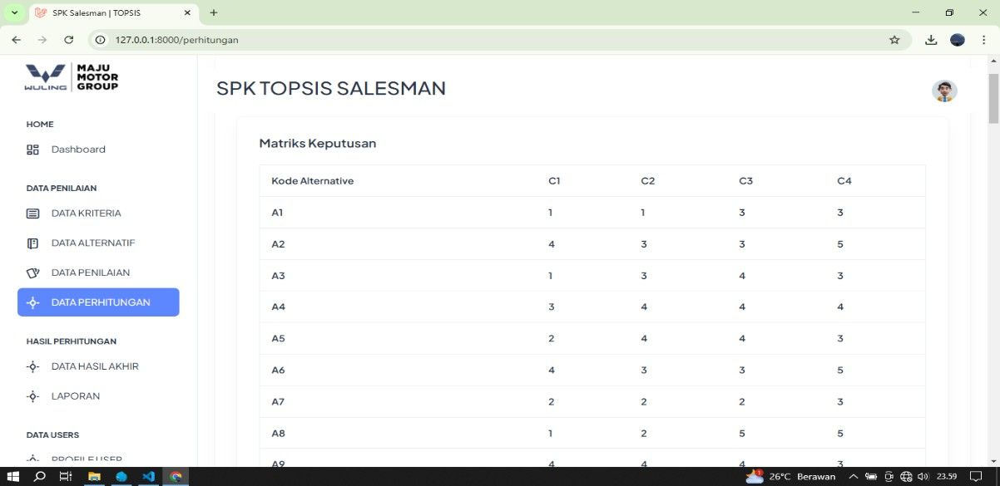
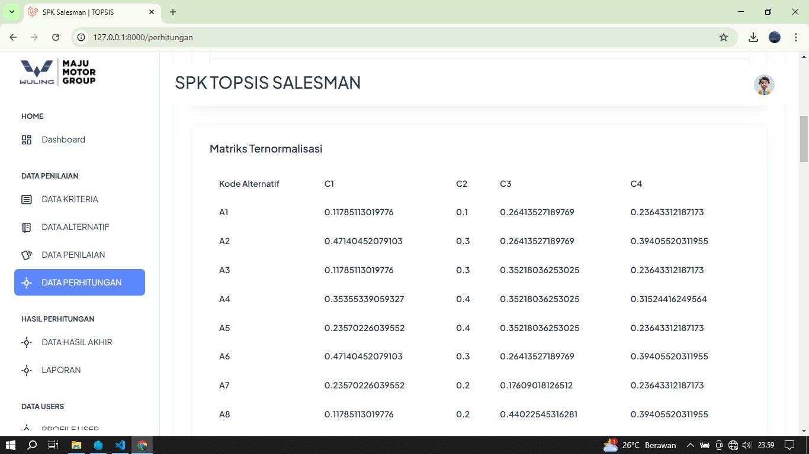
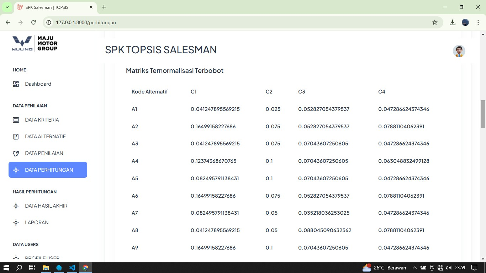
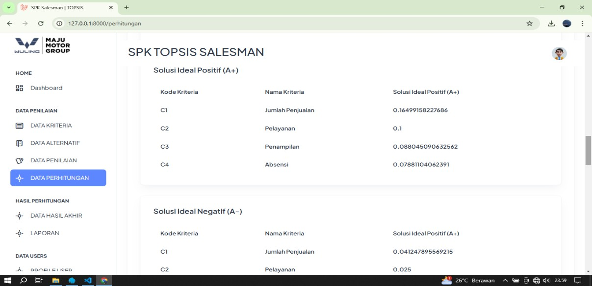
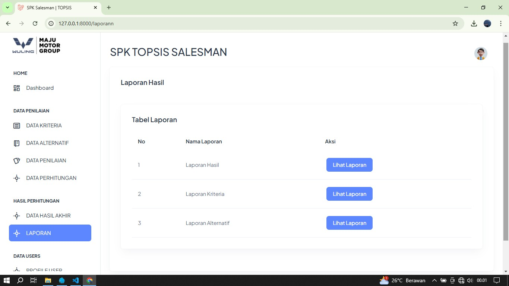
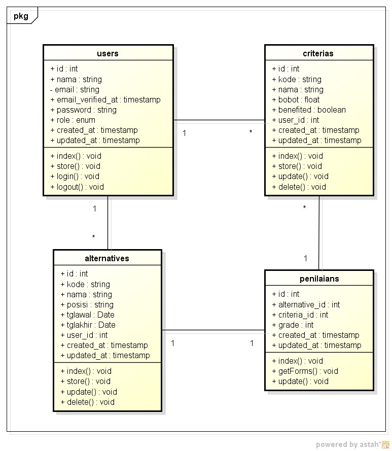

## Authors

- **Annisarh** – _Initial work_ – [GitHub Profile](https://github.com/Annisarh)  
  Feel free to add co‑authors if applicable.

## Acknowledgements

- Inspired by Laravel’s elegant framework.
- Thanks to open source libraries and community support.
- Any other acknowledgements you wish to include.
